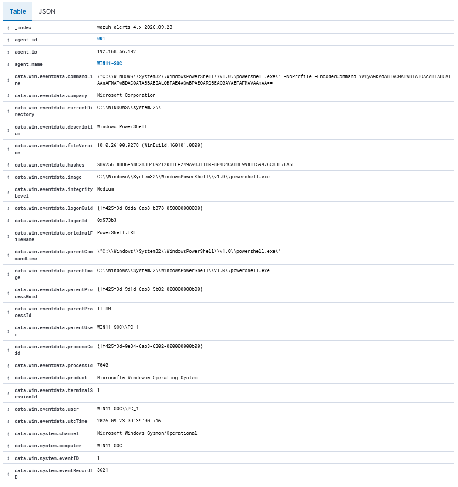
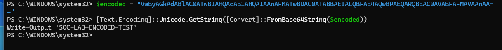

# Investigation 01: Encoded PowerShell Execution

## Executive summary

A high-severity Wazuh alert was generated after PowerShell launched another PowerShell process using the `-EncodedCommand` parameter on the `WIN11-SOC` endpoint.

Sysmon recorded the process creation as Event ID 1 and forwarded the event to Wazuh. Wazuh's built-in rule `92057` identified the Base64-encoded PowerShell execution and mapped it to MITRE ATT&CK technique [T1059.001 — PowerShell](https://attack.mitre.org/techniques/T1059/001/).

The encoded command was decoded during the investigation and found to contain a harmless lab test. The detection was therefore classified as a true positive with authorized benign activity.

## Alert details

| Field            | Value                                                                           |
| ---------------- | ------------------------------------------------------------------------------- |
| Date             | 23 September 2026                                                               |
| Local alert time | Approximately 11:39 SAST                                                        |
| Sysmon UTC time  | `2026-09-23 09:39:00.716Z`                                                      |
| Endpoint         | `WIN11-SOC`                                                                     |
| Agent ID         | `001`                                                                           |
| Endpoint IP      | `192.168.56.102`                                                                |
| User             | `WIN11-SOC\PC_1`                                                                |
| Wazuh rule       | `92057`                                                                         |
| Rule level       | `12`                                                                            |
| Description      | PowerShell spawned a PowerShell process which executed a Base64-encoded command |
| MITRE ATT&CK     | `T1059.001` — PowerShell                                                        |
| Event source     | `Microsoft-Windows-Sysmon/Operational`                                          |
| Provider         | `Microsoft-Windows-Sysmon`                                                      |
| Sysmon event ID  | `1` — Process creation                                                          |
| Classification   | True positive — authorized benign test                                          |

## Detection

Wazuh generated the following high-severity alert:


The alert was generated by Wazuh's built-in rule `92057`. A custom lab rule was initially created for the same behavior, but it was disabled after confirming that Wazuh already provided a more specific built-in detection.

## Process evidence

Sysmon captured the following process chain:

```text
powershell.exe (PID 11180)
└── powershell.exe (PID 7040)
    ├── -NoProfile
    └── -EncodedCommand <Base64 payload>
```

### Child process

```text
Image:
C:\Windows\System32\WindowsPowerShell\v1.0\powershell.exe

Process ID:
7040

Command line:
"C:\WINDOWS\System32\WindowsPowerShell\v1.0\powershell.exe" -NoProfile -EncodedCommand VwByAGkAdABlAC0ATwB1AHQAcAB1AHQAIAAnAFMATwBDAC0ATABBAEIALQBFAE4AQwBPAEQARQBEAC0AVABFAFMAVAAnAA==
```

### Parent process

```text
Image:
C:\Windows\System32\WindowsPowerShell\v1.0\powershell.exe

Process ID:
11180

Command line:
"C:\Windows\System32\WindowsPowerShell\v1.0\powershell.exe"
```

### Executable hash

```text
SHA256=8BB6FA8C283B4D92120B1EF249A9B311B0F804D4CABBE9981159976C8BE76A5E
```

The executable path and metadata were consistent with Windows PowerShell. However, a legitimate-looking path or company field alone should not be treated as proof that a binary is safe.



## Payload analysis

The Base64 value was decoded as a UTF-16LE string:

```powershell
$encoded = "VwByAGkAdABlAC0ATwB1AHQAcAB1AHQAIAAnAFMATwBDAC0ATABBAEIALQBFAE4AQwBPAEQARQBEAC0AVABFAFMAVAAnAA=="
[Text.Encoding]::Unicode.GetString([Convert]::FromBase64String($encoded))
```

Decoded payload:

```powershell
Write-Output 'SOC-LAB-ENCODED-TEST'
```



The payload only printed a test string. It did not download a file, establish persistence, access credentials, change security settings, or modify the operating system.

## Analyst assessment

### Why the alert was suspicious

The following characteristics justified investigation:

* PowerShell launched another PowerShell process.
* The child process used `-EncodedCommand`.
* The command contents were hidden from immediate human inspection.
* Encoded PowerShell is commonly used to obscure malicious commands.
* Wazuh assigned the event a high severity of level 12.

### Why the activity was benign

* The command was deliberately executed as part of an authorized lab exercise.
* The decoded payload contained only a harmless `Write-Output` command.
* No unexpected child processes or system changes were identified.
* The observed process and user matched the test activity.

## Verdict

| Category              | Assessment               |
| --------------------- | ------------------------ |
| Detection accuracy    | True positive            |
| Activity type         | Authorized security test |
| Final disposition     | Benign positive          |
| Initial severity      | High                     |
| Final contextual risk | Informational            |
| Containment required  | No                       |
| Escalation required   | No                       |

The alert correctly identified suspicious behavior. Although the activity was benign in this lab, the same behavior on an unapproved production endpoint would require immediate investigation.

## Recommended response in a real environment

If this activity were unexpected, a SOC analyst should:

1. Preserve the original command line and process telemetry.
2. Decode the payload without executing it.
3. Validate the executable's digital signature and hash.
4. Search other endpoints for the same command, hash and user activity.
5. Review related Sysmon events for network connections, created files and child processes.
6. Investigate the parent process and how the initial PowerShell session started.
7. Check for persistence mechanisms and security-control changes.
8. Isolate the endpoint if malicious activity is confirmed or strongly suspected.
9. Escalate the incident according to the organization's response procedure.

## Outcome

This exercise verified the complete detection pipeline:

```text
PowerShell execution
        ↓
Sysmon Event ID 1
        ↓
Wazuh agent collection
        ↓
Wazuh built-in rule 92057
        ↓
Level 12 alert
        ↓
SOC triage and payload analysis
        ↓
Benign-positive disposition
```

The lab successfully demonstrated endpoint telemetry collection, behavioral detection, MITRE ATT&CK mapping, evidence analysis and incident classification.
