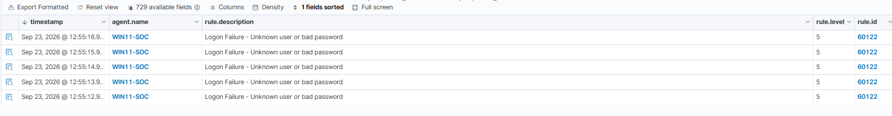

# Investigation 02: Repeated Failed Windows Logons

## Executive summary

Five failed local logon attempts were generated against the temporary `SOC-LAB-TEST` account on the `WIN11-SOC` endpoint.

Windows recorded each attempt as Security Event ID `4625`. Wazuh initially generated five individual level-5 alerts using built-in rule `60122`, but no higher-severity correlated alert was observed at this threshold.

A custom Wazuh correlation rule was created to detect five failures against the same account within 60 seconds. Testing confirmed that the new rule generated a level-10 alert and mapped the activity to MITRE ATT&CK technique `T1110.001` — Password Guessing.

No successful logon occurred after the failures. The activity was classified as a true positive caused by an authorized benign security test.

## Alert details

| Field | Value |
|---|---|
| Date | 23 September 2026 |
| Endpoint | `WIN11-SOC` |
| Target account | `SOC-LAB-TEST` |
| Windows event ID | `4625` — An account failed to log on |
| Original Wazuh rule | `60122` |
| Original rule level | `5` |
| Original description | Logon Failure — Unknown user or bad password |
| Correlation rule | `100102` |
| Correlation level | `10` |
| Correlation frequency | Five events within 60 seconds |
| Logon type | `2` — Interactive |
| Status | `0xC000006D` — Logon failure |
| Substatus | `0xC000006A` — Incorrect password |
| Process | `C:\Windows\System32\WindowsPowerShell\v1.0\powershell.exe` |
| Workstation | `WIN11-SOC` |
| MITRE ATT&CK | `T1110.001` — Password Guessing |
| Classification | True positive — authorized benign test |

## Initial detection

Wazuh's built-in rule `60122` generated five separate level-5 alerts:



The alerts occurred within several seconds and targeted the same account. However, no higher-level correlation alert was observed during the initial test.

## Event analysis

### Authentication result

The Windows status codes provided more specific information than the generic failure description:

| Value | Meaning |
|---|---|
| `0xC000006D` | The logon attempt failed |
| `0xC000006A` | The account existed, but the supplied password was incorrect |

This confirmed that the test targeted a valid local account with an incorrect password.

### Logon type

The event contained logon type `2`, representing an interactive local logon attempt.

No source IP address was present because the authentication attempt occurred locally on `WIN11-SOC`. The Wazuh `agent.ip` field identifies the monitored endpoint and should not be treated as the attacker's source address.

### Initiating process

The failed attempts were initiated by:

```text
C:\Windows\System32\WindowsPowerShell\v1.0\powershell.exe
```

PowerShell was expected in this investigation because it was used to generate the controlled authentication failures.

## Successful-logon hunt

A search was performed for Event IDs 4625 and 4624 associated with SOC-LAB-TEST.

Five failed-logon events were identified, but no successful Event ID 4624 followed them.

This indicated that the password-guessing activity did not result in account access.

## Detection gap

The built-in rule successfully detected every authentication failure, but the five related events remained separate level-5 alerts.

This could make a rapid password-guessing pattern less visible to an analyst, particularly in an environment producing a large volume of authentication events.

A custom correlation rule was therefore created to raise the severity when five failures target the same account within 60 seconds.

## Custom correlation rule
```
<group name="windows,authentication_failed,">
  <rule id="100102" level="10" frequency="5" timeframe="60" ignore="120">
    <if_matched_sid>60122</if_matched_sid>
    <same_field>win.eventdata.targetUserName</same_field>

    <description>LAB: Five Windows logon failures for account $(win.eventdata.targetUserName) within 60 seconds</description>

    <mitre>
      <id>T1110.001</id>
    </mitre>

    <group>authentication_failures,password_guessing,</group>
  </rule>
</group>
```

The rule:
- Monitors events matching built-in rule 60122.
- Requires five matches within 60 seconds.
- Correlates events with the same target username.
- Raises the alert severity to level 10.
- Suppresses duplicate correlation alerts for 120 seconds.
- Maps the activity to MITRE ATT&CK T1110.001.

## Correlation result

The repeated test successfully generated custom rule 100102:

The alert details confirmed the frequency, target account, status codes, logon type and MITRE ATT&CK mapping:

## Analyst assessment

## Why the activity was suspicious
- Five failures occurred within a few seconds.
- Every attempt targeted the same valid account.
- The incorrect password substatus indicated repeated credential attempts.
- Rapid repeated failures can indicate automated password guessing.
- The behavior mapped to MITRE ATT&CK T1110.001.

## Why the activity was benign
- The attempts were part of an authorized lab exercise.
- The temporary account was created specifically for testing.
- The activity originated locally from the expected PowerShell process.
- No successful logon followed the failures.
- No unauthorized access or additional malicious activity was identified.

## Verdict
|Category |	Assessment|
|---|---|
|Detection accuracy |	True positive |
|Activity type |	Authorized password-guessing simulation |
|Final disposition |	Benign positive |
|Original severity |	Level 5 |
|Correlated severity |	Level 10 |
|Account compromise |	Not observed |
|Containment required |	No |
|Escalation required |	No |

## Recommended response in a real environment

If this activity were unexpected, a SOC analyst should:
1. Identify the targeted account and determine whether it is privileged.
2. Determine whether the attempts originated locally or remotely.
3. Search for successful logons following the failures.
4. Review the initiating process and parent process.
5. Search other endpoints for failures involving the same account.
6. Check whether multiple accounts were targeted from the same source.
7. Review endpoint activity for additional signs of compromise.
8. Reset or disable the account if compromise is suspected.
9. Isolate the endpoint if malicious local activity is confirmed.
10. Escalate according to the organization's incident-response process.

## Outcome

This investigation demonstrated:
- Windows Security Event ID 4625 analysis.
- Interpretation of authentication status codes.
- Hunting for successful logons after repeated failures.
- Identification of a detection-correlation gap.
- Creation and testing of a custom Wazuh correlation rule.
- MITRE ATT&CK mapping.
- Alert triage and incident classification.

The custom rule successfully elevated five related level-5 alerts into one level-10 password-guessing alert.


Add this to the root README under `## Investigations`:

- [Investigation 02: Repeated Failed Windows Logons](investigations/02-repeated-failed-logons.md)
