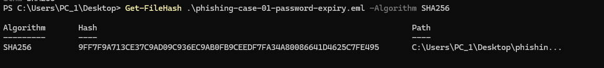
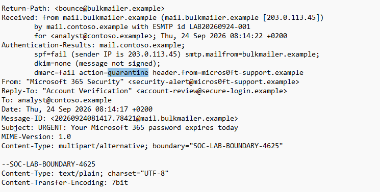
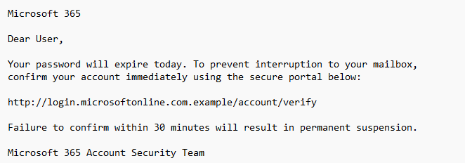

# Phishing Analysis 01: Microsoft 365 Credential Phishing

## Executive summary

An urgent email impersonating Microsoft 365 Security was received through infrastructure associated with `bulkmailer.example`.

SPF and DMARC failed, DKIM was absent, and the message used a lookalike sender domain, mismatched mail domains, generic language, urgency and a deceptive link to solicit credentials.

The receiving mail system applied a quarantine action. No user interaction, credential submission or account impact was identified. The email was classified as a true-positive credential-phishing attempt.

> This investigation used a safe synthetic email containing reserved domains and a documentation-only IP address.

## Case details

| Field | Value |
|---|---|
| Date | 24 September 2026 |
| Time | 08:14 SAST |
| Recipient | `analyst@contoso.example` |
| Displayed sender | Microsoft 365 Security |
| Sender address | `security-alert@micros0ft-support.example` |
| Reply-To | `account-review@secure-login.example` |
| Return-Path | `bounce@bulkmailer.example` |
| Sending IP | `203.0.113.45` |
| Subject | `URGENT: Your Microsoft 365 password expires today` |
| SPF | Fail |
| DKIM | None — message was not signed |
| DMARC | Fail |
| DMARC action | Quarantine |
| Classification | Credential phishing |
| Severity | Medium |
| User interaction | Not observed |
| Account compromise | Not observed |
| Final disposition | True positive — contained |

## Evidence preservation

The original email was preserved as:

[01-password-expiry.eml](evidence/01-password-expiry.eml)

A SHA256 hash was calculated to establish evidence integrity:

```text
9FF7F9A713CE37C9AD09C936EC9AB0FB9CEEDF7FA34A80086641D4625C7FE495
```

## Header analysis

### Sender identity

The displayed sender was:
```
Microsoft 365 Security
```
The actual sender address was:
```
security-alert@micros0ft-support.example
```

The domain used `micros0ft` with the number zero replacing the second letter “o” in “Microsoft.” This is a lookalike-domain technique intended to deceive recipients who only inspect the address briefly.

### Domain mismatches

The email used different domains across its identity fields:

|Header |	Domain|
|---|---|
|From |	micros0ft-support.example| 
|Reply-To |	secure-login.example|
|Return-Path |	bulkmailer.example|
|Message-ID |	mail.bulkmailer.example|

The mismatched From, Reply-To and Return-Path domains increased suspicion because replies would be directed somewhere different from the displayed sender.

### Sending infrastructure

The Received header identified:
```
mail.bulkmailer.example
203.0.113.45
```
The IP address `203.0.113.45` is documentation-only infrastructure used for this safe lab exercise.

In a real investigation, the analyst would perform reputation, ownership, passive DNS and historical activity checks without directly browsing to suspicious infrastructure.

## Email authentication
### SPF
```
spf=fail
```
The sending IP was not authorized to send email for the envelope sender domain.

### DKIM
```
dkim=none
```
The email did not contain a valid DKIM signature. This is different from a DKIM failure: the message was unsigned rather than carrying an invalid signature.

### DMARC
```
dmarc=fail action=quarantine
```
The message failed DMARC validation, and the receiving mail system applied a quarantine action.

Authentication failure alone does not always prove maliciousness. In this case, the failures were supported by multiple additional phishing indicators.

## Body and social-engineering analysis

The email contained several social-engineering indicators:

- Impersonation of Microsoft 365.
- A generic `Dear User` greeting.
- A claim that the recipient’s password would expire that day.
- Pressure to act immediately.
- A 30-minute deadline.
- A threat of permanent account suspension.
- A button labelled `Keep My Password`.
- A request to confirm account information through an external link.

The wording attempted to create fear and urgency so the recipient would act before carefully inspecting the sender and URL.

## URL analysis

The email contained:
```
http://login.microsoftonline.com.example/account/verify
```
Defanged form:
```
hxxp://login[.]microsoftonline[.]com[.]example/account/verify
```
The hostname was designed to make `login.microsoftonline.com` visually prominent. However, the full hostname ends in `.example` and is not controlled by Microsoft.

The link was therefore assessed as a deceptive credential-phishing URL.

The URL was not opened during the investigation.

## Indicators of compromise
|IOC type |	Defanged value|
|---|---|
|SHA256 |	`9FF7F9A713CE37C9AD09C936EC9AB0FB9CEEDF7FA34A80086641D4625C7FE495`|
|Sender |	`security-alert@micros0ft-support[.]example`|
|Sender domain |	`micros0ft-support[.]example`|
|Reply-To |	`account-review@secure-login[.]example`|
|Reply-To domain | `secure-login[.]example` |
|Return-Path |	`bounce@bulkmailer[.]example`|
|Sending domain |	`bulkmailer[.]example`|
|Sending IP |	`203[.]0[.]113[.]45` |
|URL |	`hxxp://login[.]microsoftonline[.]com[.]example/account/verify`|
|Message-ID |	`20260924081417.78421@mail[.]bulkmailer[.]example`|
|Subject |	`URGENT: Your Microsoft 365 password expires today`|

## MITRE ATT&CK mapping
### Observed technique
|Technique |	Name |	Tactic|
|---|---|---|
|`T1566.002` |	Phishing: Spearphishing Link |	Initial Access|

The email delivered a deceptive link and attempted to persuade the recipient to interact with it.

### Suspected objective
|Technique |	Name |	Tactic|
|---|---|---|
|`T1056.003` |	Input Capture: Web Portal Capture	| Credential Access / Collection|

The apparent objective was to direct the user to a fake account-verification portal and capture credentials.

This technique was recorded as suspected intent rather than confirmed activity because the URL was not visited and no credential capture was observed.

## Scope and impact assessment

The investigation found:
- No evidence that the recipient opened the link.
- No evidence that credentials were submitted.
- No related successful account access.
- No attachment or malware payload.
- No confirmed endpoint compromise.
- No confirmed account compromise.

The incident therefore remained an attempted credential-phishing delivery with no observed impact.

## Recommended response

A SOC analyst should:
1. Preserve the original email and calculate its hash.
2. Quarantine the message.
3. Search all mailboxes for the sender, subject, URL and Message-ID.
4. Remove matching messages that reached other recipients.
5. Block the malicious sender domains, URL and sending IP where appropriate.
6. Review email-security, proxy and DNS logs for link interaction.
7. Contact recipients to determine whether they clicked the link.
8. Review identity-provider logs for suspicious authentication activity.
9. If credentials were submitted, reset the password and revoke active sessions.
10. Confirm that MFA remains enabled and investigate unexpected MFA activity.
11. Document the extracted indicators and final disposition.
12. Notify users or security teams if the campaign affected additional recipients.

## Verdict
|Category |	Assessment|
|---|---|
|Detection accuracy |	True positive |
|Threat category |	Credential phishing |
|Delivery method	| Email with deceptive link |
|Severity |	Medium |
|User interaction |	Not observed |
|Credential compromise |	Not observed |
|Endpoint compromise | Not observed|
|Containment |	Message quarantined |
|Escalation required |	No, unless wider delivery or interaction is discovered |
|Final disposition	| True positive — contained |

## Outcome

This exercise demonstrated:
- Safe preservation and hashing of email evidence.
- Analysis of email headers.
- Interpretation of SPF, DKIM and DMARC results.
- Identification of lookalike and mismatched domains.
- Recognition of urgency-based social engineering.
- Safe URL analysis and defanging.
- IOC extraction.
- MITRE ATT&CK mapping.
- Impact assessment and response planning.

The email was conclusively classified as credential phishing, and no user or account impact was identified.
