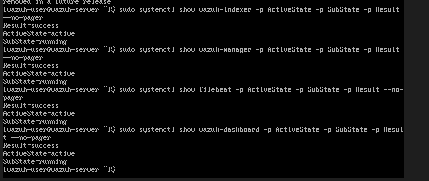
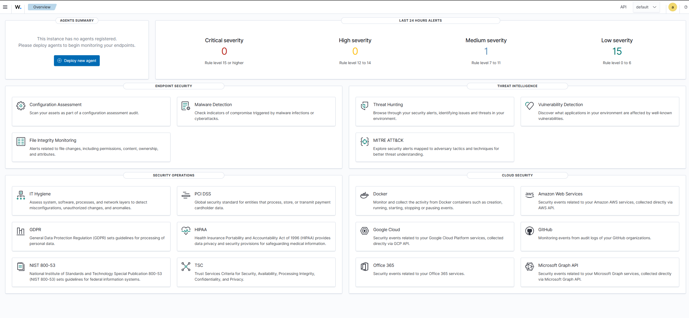
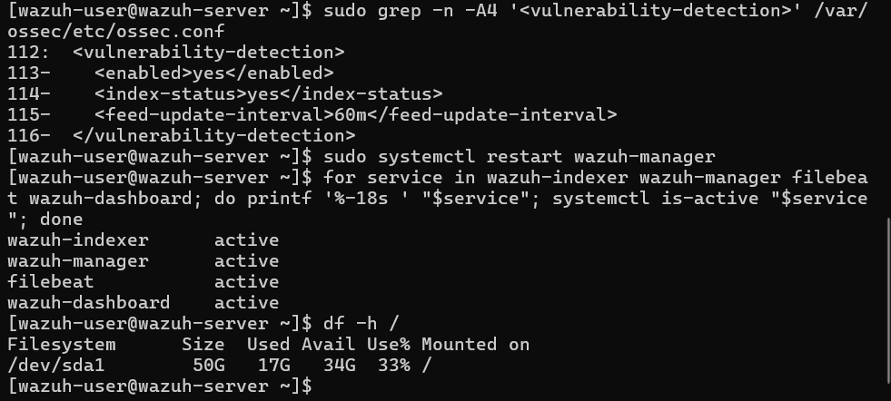

# Stage 1 — Wazuh Server Deployment

## Objective

Deploy and secure a central Wazuh server that will collect and analyse security events from a Windows endpoint.

## Environment

- Wazuh 4.14.7 virtual appliance
- Oracle VirtualBox
- Amazon Linux 2023
- 4 virtual CPU cores
- 8 GB RAM
- 50 GB virtual storage

## Network Configuration

The Wazuh server uses two virtual network adapters:

- **NAT adapter:** Provides outbound internet access for updates and downloads.
- **Host-only adapter:** Provides private communication between the host computer, Wazuh server and future Windows endpoint.

This keeps the monitoring environment separated from the physical network while still allowing the virtual machines to download required software.

## Deployment Process

1. Downloaded the official Wazuh OVA.
2. Imported the appliance into VirtualBox.
3. Configured the VM with four CPU cores and 8 GB of memory.
4. Selected VMSVGA as the graphics controller.
5. Enabled the hardware clock in UTC.
6. Configured NAT and host-only network adapters.
7. Started the server and identified its network interfaces using `ip a`.
8. Accessed the Wazuh dashboard over HTTPS.
9. Replaced the default Linux and dashboard passwords.
10. Verified that all central Wazuh services were running successfully.

## Service Verification

The following services were checked:

- Wazuh indexer
- Wazuh manager
- Filebeat
- Wazuh dashboard

Each service returned:

```text
Result=success
ActiveState=active
SubState=running
```



## Dashboard Verification

The Wazuh dashboard was successfully accessed from the host computer through the private host-only network.

No endpoint agents were registered at this stage, which is expected because the Windows endpoint has not yet been deployed.

## Troubleshooting

After changing the administrator password, the dashboard temporarily returned an HTTP 500 internal server error.

The issue was investigated by checking the state of the Wazuh services. The services were restarted and then verified individually using `systemctl show`.



This demonstrated the importance of:

- Reloading services after credential changes
- Checking individual service states
- Distinguishing between Linux and dashboard accounts
- Verifying the full monitoring pipeline after configuration changes

## Security Measures
- Replaced the default credentials.
- Kept the dashboard on a private host-only network.
- Did not configure router port forwarding.
- Kept passwords and sensitive configuration out of GitHub.

## Storage recovery and VM expansion

The Wazuh manager stopped because its original 25 GB virtual disk reached 100% usage. Investigation identified the main storage consumers as the vulnerability detection database and temporary updater content under `/var/ossec/queue/`.

Recovery actions:

- Cleared 8.6 GB of temporary vulnerability updater content.
- Temporarily disabled Vulnerability Detection.
- Created a full clone of the current Wazuh VM.
- Expanded the cloned VDI from 25 GB to 50 GB.
- Expanded `/dev/sda1` and its XFS filesystem.
- Re-enabled Vulnerability Detection.
- Confirmed `wazuh-indexer`, `wazuh-manager`, `filebeat`, and `wazuh-dashboard` were active.

Final filesystem status:

- Capacity: 50 GB
- Used: 17 GB
- Available: 34 GB
- Usage: 33%



## Next Steps
- [ ] Create a clean Wazuh server snapshot
- [ ] Build the Windows 11 endpoint
- [ ] Install the Wazuh agent
- [ ] Connect the endpoint to the Wazuh server
- [ ] Confirm that Windows events reach the dashboard
