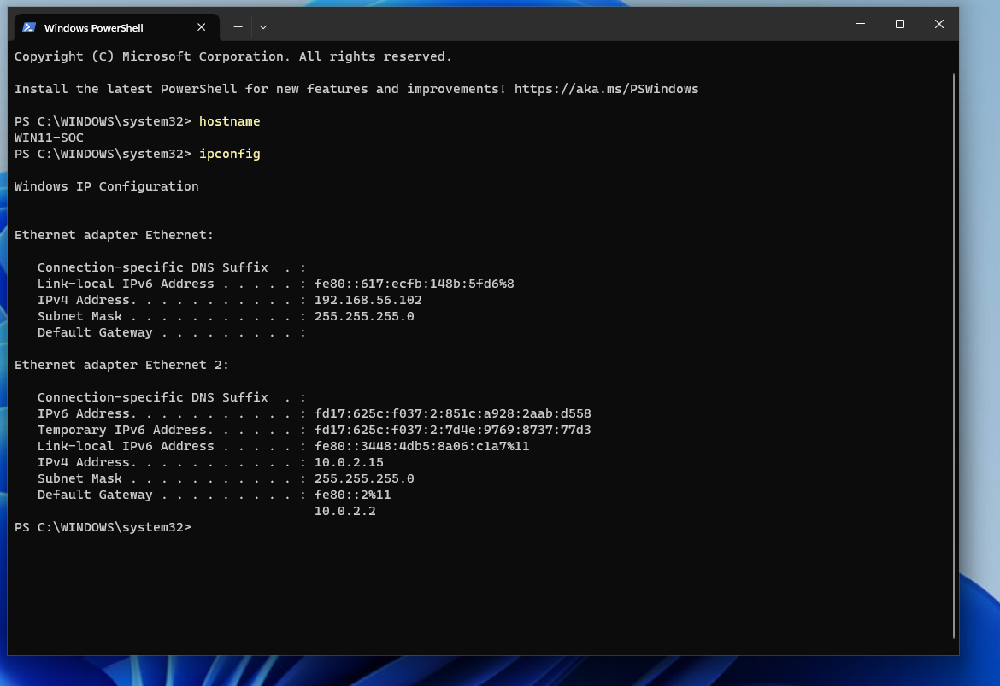
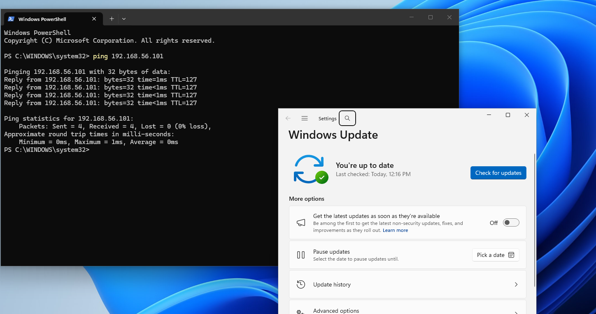
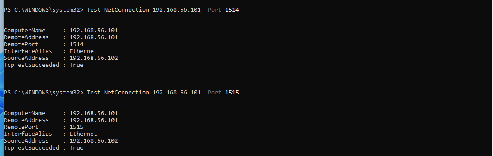
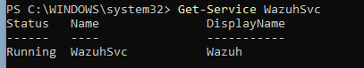
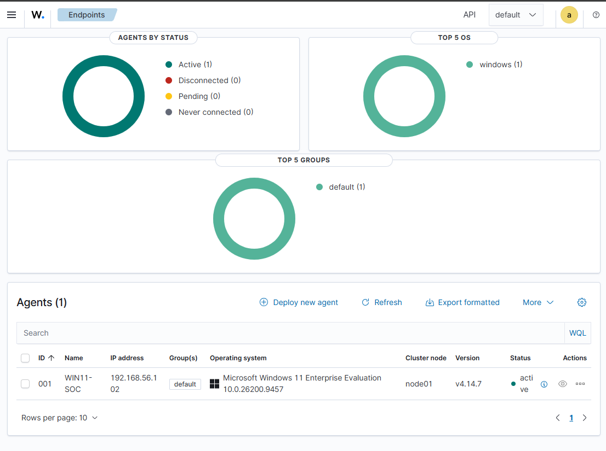
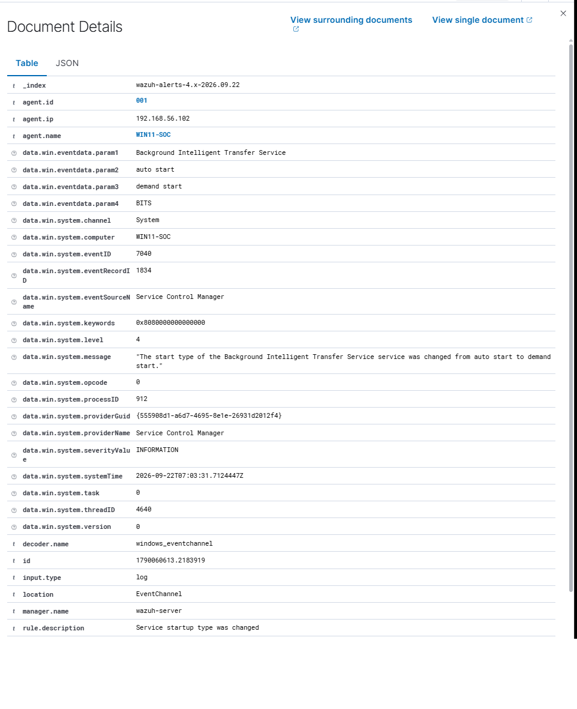

# Windows 11 Endpoint Deployment

## Objective

Create a clean Windows 11 endpoint that can be monitored by the Wazuh server.

## Environment

- Windows 11 Enterprise Evaluation
- Oracle VirtualBox
- Hostname: `WIN11-SOC`
- 4 virtual CPU cores
- 6 GB RAM
- 64 GB dynamically allocated storage
- VirtualBox Guest Additions

## Network Configuration

The endpoint uses two virtual network adapters:

- **NAT adapter:** Provides internet access for Windows updates and software downloads.
- **Host-only adapter:** Provides private communication with the Wazuh server.

The addresses assigned during setup were:

| System | Host-only address | Purpose |
|---|---:|---|
| Wazuh server | `192.168.56.101` | Monitoring server |
| Windows endpoint | `192.168.56.102` | Monitored endpoint |



These addresses are assigned by DHCP and may change after restarting the virtual machines.

## Setup Process

1. Created the Windows 11 virtual machine.
2. Allocated four CPU cores, 6 GB RAM and 64 GB storage.
3. Configured NAT and host-only network adapters.
4. Installed Windows 11 Enterprise Evaluation.
5. Renamed the endpoint to `WIN11-SOC`.
6. Installed VirtualBox Guest Additions.
7. Installed all available Windows updates.
8. Confirmed both network adapters using `ipconfig`.
9. Tested communication with the Wazuh server using `ping`.

## Connectivity Verification

The Windows endpoint successfully reached the Wazuh server through the private host-only network.

```text
Packets: Sent = 4, Received = 4, Lost = 0 (0% loss)
```


## Security Notes
- The endpoint communicates with Wazuh through an isolated host-only network.
- Internet access is provided separately through NAT.
- No router ports are forwarded to either virtual machine.
- Credentials and personal information are excluded from the repository.
- A clean baseline snapshot was created before installing monitoring software.

## Wazuh Agent Enrollment

Installed the Wazuh 4.14.7 Windows agent on `WIN11-SOC` and configured it to connect to the Wazuh server over the private lab network.

Verified that the endpoint could reach the server on TCP ports 1514 and 1515, that the Windows `WazuhSvc` service was running, and that the dashboard listed `WIN11-SOC` as Active.







## Windows Event Verification

Confirmed that the Wazuh agent sends Windows events to the server.

An alert from agent `001` (`WIN11-SOC`) showed a Windows System event with ID `7040`. Wazuh decoded the event and displayed the rule description, affected service and event time. This verifies the path from the Windows event log through the agent to the Wazuh dashboard.



### Sysmon event collection verified

- Confirmed Sysmon process events in the Windows event log.
- Configured the Wazuh agent to collect `Microsoft-Windows-Sysmon/Operational`.
- Launched Notepad as a test. A search of Wazuh's temporary JSON event archive found 2 records containing `notepad.exe`, confirming delivery to the manager.
- Disabled full event archiving after the test and confirmed `wazuh-manager` was active.

**Storage note:** The Wazuh VM's original 25 GB disk filled with vulnerability feed data. After clearing temporary updater content, the virtual disk and XFS filesystem were expanded to 50 GB. Vulnerability Detection was then re-enabled, and all Wazuh services were confirmed active.

## Completed Steps

- [x] Install the Wazuh Windows agent
- [x] Register the endpoint with the Wazuh server
- [x] Confirm that Windows events appear in the dashboard
- [x] Install and configure Sysmon
- [x] Verify Sysmon telemetry reaches Wazuh
